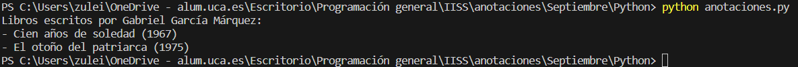

# Ejemplo de uso de anotaciones en Python


En este ejemplo, desarrollaremos un sistema básico de gestión de bibliotecas en Python utilizando anotaciones de tipo y clases de datos. Utilizaremos las dataclasses de Python para definir las clases Autor y Libro, que representan a un autor y a un libro, respectivamente. Además, crearemos una función llamada buscar_libros_por_autor que permite buscar en una biblioteca los libros escritos por un autor específico.

A través de este ejemplo, exploraremos cómo las anotaciones de tipo pueden mejorar la claridad y la comprensión del código al proporcionar información sobre los tipos de datos esperados y devueltos. Además, veremos cómo utilizar las clases de datos para organizar la información de manera estructurada en nuestro sistema de gestión de bibliotecas.


## Implementación

### anotaciones.py
```py
from dataclasses import dataclass
from typing import List

@dataclass
class Autor:
    nombre: str
    nacionalidad: str

@dataclass
class Libro:
    titulo: str
    autor: Autor
    anio_publicacion: int

def buscar_libros_por_autor(biblioteca: List[Libro], autor_a_buscar: str) -> List[Libro]:
    """
    Busca libros en la biblioteca por el nombre del autor.

    :param biblioteca: Lista de libros en la biblioteca.
    :type biblioteca: list[Libro]
    :param autor_a_buscar: Nombre del autor a buscar.
    :type autor_a_buscar: str
    :return: Lista de libros escritos por el autor buscado.
    :rtype: list[Libro]
    """
    libros_del_autor = [libro for libro in biblioteca if libro.autor.nombre == autor_a_buscar]
    return libros_del_autor

# Crear algunos autores y libros
autor1 = Autor(nombre="Gabriel García Márquez", nacionalidad="Colombiana")
autor2 = Autor(nombre="J.K. Rowling", nacionalidad="Británica")

libro1 = Libro(titulo="Cien años de soledad", autor=autor1, anio_publicacion=1967)
libro2 = Libro(titulo="Harry Potter y la piedra filosofal", autor=autor2, anio_publicacion=1997)
libro3 = Libro(titulo="El otoño del patriarca", autor=autor1, anio_publicacion=1975)

# Crear una biblioteca
biblioteca = [libro1, libro2, libro3]

# Buscar libros por autor
autor_buscado = "Gabriel García Márquez"
libros_del_autor = buscar_libros_por_autor(biblioteca, autor_buscado)

# Imprimir resultados
print(f"Libros escritos por {autor_buscado}:")
for libro in libros_del_autor:
    print(f"- {libro.titulo} ({libro.anio_publicacion})")

```


El código es un simulacro simple de un sistema de gestión de bibliotecas en Python:
* **Paso 1: Definición de clases**.

Importamos las bibliotecas necesarias. Creamos la clase `Autor` usando `@dataclass` para definir una clase de datos con dos atributos: `nombre` y `nacionalidad`. Creamos la clase `Libro` también usando `@dataclass`. Un libro tiene un título (`titulo`), un autor (`autor`, que es una instancia de la clase `Autor`), y un año de publicación (`anio_publicacion`).
* **Paso 2: Definición de funciones**.

Definimos una función llamada `buscar_libros_por_autor`. Esta función toma como entrada una lista de libros (`biblioteca`) y el nombre de un autor (`autor_a_buscar`). La función devuelve una lista de libros escritos por el autor buscado.

* **Paso 3: Creación de Objetos y Uso de la Función**.

Creamos instancias de las clases `Autor` y `Libro`. Creamos una lista llamada `biblioteca` que contiene los libros que hemos creado. Llamamos a la función `buscar_libros_por_autor` para encontrar libros escritos por el autor especificado.

**Uso de anotaciones**

1. Anotaciones en las Clases de Datos:
Las clases `Autor` y `Libro` están decoradas con `@dataclass` y tienen anotaciones en sus atributos (`nombre`, `nacionalidad`, `titulo`, `autor`, `anio_publicacion`). Estas anotaciones indican los tipos de datos que se esperan para cada atributo.

2. Anotación en la Función `buscar_libros_por_autor`:
En la firma de la función `buscar_libros_por_autor`, las anotaciones (`List[Libro]`, `str`, `List[Libro]`) indican los tipos de datos esperados y devueltos por la función. Por ejemplo, la lista biblioteca debe contener objetos de tipo `Libro`, y la función devuelve una lista de `Libro`.

3. Ejemplo de Creación de Objetos con Anotaciones de Tipo:
Al crear instancias de las clases `Autor` y `Libro`, las anotaciones de tipo no son necesarias, pero el código muestra cómo se podrían utilizar al proporcionar valores específicos a los atributos.

En resumen, las anotaciones en este ejemplo se centran en indicar los tipos de datos para los atributos de las clases de datos y para los parámetros y valores de retorno de la función buscar_libros_por_autor. Estas anotaciones son útiles para proporcionar claridad sobre la estructura del código y facilitar el mantenimiento y la comprensión del mismo.

### Ejecución del código
Para ejecutar este código desde terminal, los pasos a seguir son:
1. Asegurarse de tener Python instalado en el sistema.
2. Tener el archivo `.py` en el mismo directorio.
3. Abrir una terminal que apunte al directorio que contiene el archivo.
4. Ejecutar el siguiente comando para ejecutar el código
```bash
python anotaciones.py
```

#### Resultado Esperado


Al realizar la ejecución del programa el resultado esperado es: 
```bash
Libros escritos por Gabriel García Márquez:
- Cien años de soledad (1967)
- El otoño del patriarca (1975)
```


#### Resultado Obtenido

Hacemos una ejecución en el que obtenemos el siguiente resultado (que es variable en función de la interacción de cada usuario):


