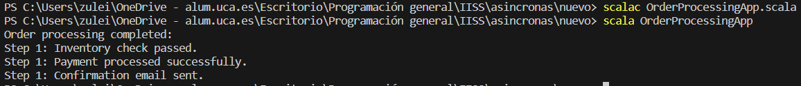

# Ejemplo de uso de Asincronas en Scala


Este ejemplo ilustra cómo procesar una orden de manera asíncrona en Scala, utilizando `Future` y cómo manejar los resultados. En Scala, `Future` se utiliza para realizar operaciones asincrónicas y esperar sus resultados de manera concurrente.


## Implementación

### Order.scala
```scala
case class Order(orderId: Int, items: List[String], totalAmount: Double)
case class OrderProcessingResult(orderId: Int, success: Boolean, message: String)
```


* Se definen dos objetos case: `Order` y `OrderProcessingResult`. Estos objetos se utilizan para representar los datos relacionados con las órdenes y los resultados del procesamiento de órdenes.


### OrderProcessor.scala
```scala
import scala.concurrent._
import scala.concurrent.ExecutionContext.Implicits.global

object OrderProcessor {
  def checkInventory(order: Order): Future[OrderProcessingResult] = {
    val result = OrderProcessingResult(order.orderId, itemInventoryAvailable(order.items), "Inventory check passed.")
    Future.successful(result)
  }

  def processPayment(order: Order): Future[OrderProcessingResult] = {
    val result = OrderProcessingResult(order.orderId, isPaymentSuccessful(), "Payment processed successfully.")
    Future.successful(result)
  }

  def sendConfirmationEmail(order: Order): Future[OrderProcessingResult] = {
    val result = OrderProcessingResult(order.orderId, sendEmail(order), "Confirmation email sent.")
    Future.successful(result)
  }

  private def itemInventoryAvailable(items: List[String]): Boolean = {
    // Simulate item availability
    !items.contains("out_of_stock_item")
  }

  private def isPaymentSuccessful(): Boolean = {
    // Simulate payment success
    math.random() < 0.8
  }

  private def sendEmail(order: Order): Boolean = {
    // Simulate email sending
    math.random() < 0.9
  }
}
```


* El objeto `OrderProcessor` contiene métodos para simular tres etapas de procesamiento de una orden: verificar el inventario, procesar el pago y enviar un correo electrónico de confirmación. Cada método devuelve un `Future[OrderProcessingResult]` que representa el resultado de la operación correspondiente.


### OrderProcessingApp.scala

```scala
import scala.concurrent._
import scala.util.{Success, Failure}
import scala.concurrent.duration.Duration

object OrderProcessingApp extends App {
  implicit val ec: ExecutionContext = scala.concurrent.ExecutionContext.global

  val order = Order(1, List("item1", "item2", "item3"), 100.0)

  val inventoryFuture = OrderProcessor.checkInventory(order)
  val paymentFuture = OrderProcessor.processPayment(order)
  val emailFuture = OrderProcessor.sendConfirmationEmail(order)

  val processingResultFuture: Future[Seq[OrderProcessingResult]] = for {
    inventoryResult <- inventoryFuture
    paymentResult <- paymentFuture
    emailResult <- emailFuture
  } yield Seq(inventoryResult, paymentResult, emailResult)

  processingResultFuture.onComplete {
    case Success(results) =>
      println("Order processing completed:")
      results.foreach(result => println(s"Step ${result.orderId}: ${result.message}"))

    case Failure(ex) =>
      println(s"Order processing failed: ${ex.getMessage}")
  }

  // Sleep for a short time to allow asynchronous operations to complete
  Thread.sleep(3000)
}
```


* Se define un contexto de ejecución implícito (`ExecutionContext`) llamado `ec`, que se utiliza para ejecutar las operaciones asíncronas.
* Se crea una instancia de la clase `Order` que representa la orden que se va a procesar.
* Se inician tres operaciones asincrónicas para verificar el inventario, procesar el pago y enviar el correo electrónico de confirmación. Cada operación devuelve un `Future[OrderProcessingResult]`.
* Los resultados de estas operaciones se combinan utilizando un for comprehension para obtener un `Future[Seq[OrderProcessingResult]] ` llamado `processingResultFuture`.
* Se registra un callback utilizando `onComplete` en `processingResultFuture` para manejar el éxito o el fracaso de las operaciones asíncronas.
* Finalmente, se introduce un retardo de 3 segundos (`Thread.sleep(3000)`) en el hilo principal para permitir que las operaciones asíncronas se completen.

### Ejecución del código
Para ejecutar este código desde terminal, los pasos a seguir son:
1. Asegurarse de tener Scala instalado en el sistema.
2. Tener los archivos `.scala` en el mismo directorio.
3. Abrir una terminal que apunte al directorio que contiene los archivos.
4. Ejecutar el siguiente comando para compilar el código
```bash
scalac OrderProcessingApp.scala
```
5. Una vez compilado con éxito, puedes ejecutar el programa Scala con el comando:
```bash
scala OrderProcessingApp
```

#### Resultado Esperado

Después de ejecutar el programa, obtendrás una salida en la terminal que mostrará el resultado del procesamiento de la orden. Dependiendo de la aleatoriedad incorporada en la simulación de operaciones como la verificación del inventario, el procesamiento del pago y el envío del correo electrónico, verás mensajes que indican si cada paso se completó con éxito o si hubo un error. La salida mostrará algo parecido a esto:

```bash
Order processing completed:
Step 1: Inventory check passed.
Step 1: Payment processed successfully.
Step 1: Confirmation email sent.
```

Si alguna de las operaciones falla, debemos ver un mensaje de error como este:
```bash
Order processing failed: Payment processing failed.
```
#### Resultado Obtenido

Efectivamente el resultado obtenido es el mismo al esperado, como podemos observar en la siguiente foto:

