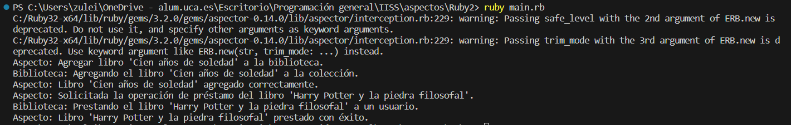

# Ejemplo de uso de Aspectos en Ruby


Para hacer uso de la programación orientada a aspectos en Ruby debemos hacer uso de gemas como `aspector` que nos permite implementar aspectos dado que no tiene un soporte nativo para AOP. AOP funciona en Ruby con `aspector` de la siguiente forma:
1. **Definición de Aspectos**: En Ruby, se utilizan clases para definir aspectos. Estas clases heredan de `Aspector::Base`, proporcionada por la gema `aspector`. Dentro de estas clases de aspecto, se definen los advices que encapsulan el comportamiento a aplicar en los join points específicos.

2. **Aplicación de Aspectos**: Los aspectos se aplican a objetos o clases específicas en el código principal de la aplicación. Esto se logra mediante el método `apply` proporcionado por `aspector`. Los aspectos pueden aplicarse de manera selectiva a objetos o clases específicas, lo que permite una gran flexibilidad.

3. **Definición de Advices**: Dentro de los aspectos, se definen los advices que determinan qué hacer antes, después o alrededor de los join points. Por ejemplo, puede haber un advice que registre tiempos de ejecución, otro que maneje excepciones o uno que realice registros de auditoría.

4. **Ejecución de Advices**: Cuando se ejecuta el programa, los advices se ejecutan automáticamente en los join points especificados por los pointcuts. Esto permite agregar funcionalidad adicional en esos puntos de la aplicación sin modificar el código original de la aplicación.


## Implementación

### biblioteca_aspecto.rb
```ruby
# biblioteca_aspecto.rb

require 'aspector'

class BibliotecaAspecto < Aspector::Base
  around :agregar_libro, method_arg: true do |method, proxy, *args, &block|
    libro = args[0]
    puts "Aspecto: Agregar libro '#{libro}' a la biblioteca."
    proxy.call(*args, &block)
    puts "Aspecto: Libro '#{libro}' agregado correctamente."
  end

  around :prestar_libro, method_arg: true do |method, proxy, *args, &block|
    libro = args[0]
    puts "Aspecto: Solicitada la operación de préstamo del libro '#{libro}'."
    proxy.call(*args, &block)
    puts "Aspecto: Libro '#{libro}' prestado con éxito."
  end
end
```


* Este archivo define el aspecto llamado `BibliotecaAspecto`. En este aspecto, se utiliza el método `around` para envolver dos métodos específicos (`agregar_libro` y `prestar_libro`) de la clase `Biblioteca`. El aspecto registra mensajes antes y después de la ejecución de estos métodos.


### biblioteca.rb
```ruby
# biblioteca.rb

class Biblioteca
    def agregar_libro(libro)
      # Lógica para agregar un libro a la biblioteca
      puts "Biblioteca: Agregando el libro '#{libro}' a la colección."
    end
  
    def prestar_libro(libro)
      # Lógica para prestar un libro a un usuario
      puts "Biblioteca: Prestando el libro '#{libro}' a un usuario."
    end
  end

```


* En este archivo se define la clase `Biblioteca`, que representa una biblioteca ficticia. La clase contiene dos métodos: `agregar_libro` y `prestar_libro`. Estos métodos realizan operaciones relacionadas con la biblioteca, como agregar un libro a la colección y prestar un libro a un usuario.


### main.rb

```ruby
# main.rb

require 'aspector'
require_relative 'biblioteca_aspecto'
require_relative 'biblioteca'

# Crear una instancia de Biblioteca
biblioteca = Biblioteca.new

# Aplicar el aspecto a la Biblioteca
BibliotecaAspecto.apply(biblioteca)

# Ejecutar algunas operaciones en la biblioteca
biblioteca.agregar_libro("Cien años de soledad")
biblioteca.prestar_libro("Harry Potter y la piedra filosofal")
```


* Contiene el código principal que utiliza el aspecto y la clase `Biblioteca`. Para ello, hacemos lo siguiente:
    * Creamos la isntacia de `Biblioteca` llamada `biblioteca`.
    * Para la aplicación del aspecto utilizamos `BibliotecaAspecto.apply(biblioteca)` de este modo el aspecto envolverá los métodos específicos de `biblioteca`.
    * Posteriormente, llamamos a dos métodos en `biblioteca`: `agregar_libro` y `prestar_libro`. Estas operaciones son las que serán interceptadas por el aspecto.
### Ejecución del código
Para ejecutar este código desde terminal, los pasos a seguir son:
1. Asegurarse de tener Ruby instalado en el sistema.
2. Instalamos (si no la tenemos) la gema de Ruby `aspector` usando el comando:
```bash
gem install aspector
```
3. Tener los archivos `.rb` en el mismo directorio.
4. Abrir una terminal que apunte al directorio que contiene los archivos.
5. Ejecutar el siguiente comando para ejecutar el código
```bash
ruby main.rb
```

#### Resultado Esperado

Cuando se ejecuta el programa, debemos ver una serie de mensajes en la consola que indican las operaciones realizadas y cómo el aspecto registra estas operaciones antes y después de su ejecución. El resultado esperado es:
```bash
Aspecto: Agregar libro 'Cien años de soledad' a la biblioteca.
Biblioteca: Agregando el libro 'Cien años de soledad' a la colección.
Aspecto: Libro 'Cien años de soledad' agregado correctamente.
Aspecto: Solicitada la operación de préstamo del libro 'Harry Potter y la piedra filosofal'.
Biblioteca: Prestando el libro 'Harry Potter y la piedra filosofal' a un usuario.
Aspecto: Libro 'Harry Potter y la piedra filosofal' prestado con éxito.
```


Estos mensajes demuestran cómo el aspecto BibliotecaAspecto envuelve las operaciones de agregar_libro y prestar_libro de la clase Biblioteca, lo que permite agregar comportamiento adicional a la clase sin modificar su código original.


#### Resultado Obtenido

Hacemos una ejecución en el que obtenemos el siguiente resultado:

