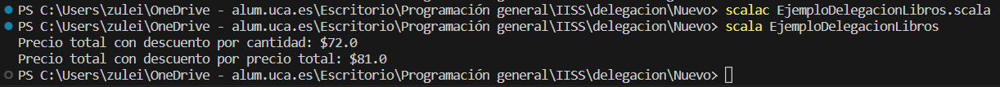

# Ejemplo de Uso de Delegación en Scala

Este ejemplo tiene como objetivo demostrar el concepto de delegación en Scala a través de una implementación sencilla. Se utiliza una jerarquía de clases y objetos para calcular el precio total con descuento de una lista de libros utilizando diferentes políticas de descuento.


## Implementación

### Libro.scala

```scala
case class Libro(titulo: String, autor: String, precio: Double)
```


### EjemploDelegaciónLibros.scala
```scala
object EjemploDelegacionLibros {
  def main(args: Array[String]): Unit = {
    val libros = List(
      Libro("El principito", "Antoine de Saint-Exupéry", 15.0),
      Libro("Cien años de soledad", "Gabriel García Márquez", 20.0),
      Libro("Don Quijote de la Mancha", "Miguel de Cervantes", 25.0),
      Libro("1984", "George Orwell", 18.0),
      Libro("El retrato de Dorian Gray", "Oscar Wilde", 12.0)
    )

    val compra = new Compra()

    val descuentoPorCantidad = new DescuentoPorCantidad()
    val descuentoPorPrecioTotal = new DescuentoPorPrecioTotal()

    val precioTotalConDescuento1 = compra.calcularPrecioTotal(libros, descuentoPorCantidad)
    val precioTotalConDescuento2 = compra.calcularPrecioTotal(libros, descuentoPorPrecioTotal)

    println(s"Precio total con descuento por cantidad: $$${precioTotalConDescuento1}")
    println(s"Precio total con descuento por precio total: $$${precioTotalConDescuento2}")
  }
}
```


* Se crea una lista de libros llamada libros. Cada libro es un objeto de la clase Libro, que tiene tres atributos: `titulo`, `autor`, y `precio`.
* La lista `libros` contiene información sobre cinco libros diferentes. Esto proporciona datos de entrada para calcular el precio total con descuento.
* Se crea una instancia de la clase `Compra` llamada `compra`.
* Se crean dos instancias de clases que heredan de la clase abstracta `PoliticaDescuento`. Estas instancias representan dos políticas de descuento diferentes:
    * `descuentoPorCantidad` es una instancia de la clase DescuentoPorCantidad.
    * `descuentoPorPrecioTotal` es una instancia de la clase DescuentoPorPrecioTotal.

* Se llama al método `calcularPrecioTotal` de la instancia `compra` dos veces.
* La primera llamada calcula el precio total con descuento utilizando la política de descuento representada por `descuentoPorCantidad`.
* La segunda llamada calcula el precio total con descuento utilizando la política de descuento representada por `descuentoPorPrecioTotal`.
* Se imprimen los resultados en la consola utilizando println. Los valores se imprimen en formato de cadena, utilizando interpolación de cadenas para mostrar los resultados de manera legible.


### PoliticaDescuento.scala
```scala
abstract class PoliticaDescuento {
  def calcularDescuento(libros: List[Libro]): Double
}

class DescuentoPorCantidad extends PoliticaDescuento {
  override def calcularDescuento(libros: List[Libro]): Double = {
    val numLibros = libros.length
    if (numLibros >= 5) 0.2 else if (numLibros >= 3) 0.1 else 0.0
  }
}

class DescuentoPorPrecioTotal extends PoliticaDescuento {
  override def calcularDescuento(libros: List[Libro]): Double = {
    val precioTotal = libros.map(_.precio).sum
    if (precioTotal >= 100) 0.15 else if (precioTotal >= 50) 0.1 else 0.05
  }
}
```


* Cada política de descuento implementa su propia lógica de cálculo de descuento, que se basa en la cantidad de libros o en el precio total de los libros.


### Compra.scala

```scala
class Compra {
  def calcularPrecioTotal(libros: List[Libro], politicaDescuento: PoliticaDescuento): Double = {
    val descuento = politicaDescuento.calcularDescuento(libros)
    val precioTotal = libros.map(_.precio).sum
    precioTotal - (precioTotal * descuento)
  }
}
```


* La clase `Compra` tiene la responsabilidad de calcular el precio total con descuento en función de una política de descuento específica.


### Ejecución del código
Para ejecutar este código desde terminal, los pasos a seguir son:
1. Asegurarse de tener Scala instalado en el sistema.
2. Tener los archivos `.scala` en el mismo directorio.
3. Abrir una terminal que apunte al directorio que contiene los archivos.
4. Ejecutar el siguiente comando para compilar el código
```bash
scalac EjemploDelegacionLibros.scala
```
5. Una vez compilado con éxito, puedes ejecutar el programa Scala con el comando:
```bash
scala EjemploDelegacionLibros
```

#### Resultado Esperado

Después de ejecutar el programa, el resultado esperado en la consola es:
```bash
Precio total con descuento por cantidad: $72.0
Precio total con descuento por precio total: $81.0
```

#### Resultado Obtenido

Efectivamente el resultado obtenido es el mismo al esperado, como podemos observar en la siguiente foto:


