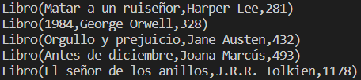

# Delegación en Java


## Implementación


### Clase Libro

```js
public class Libro {
    private String titulo;
    private String autor;
    private double precio;
    
    public Libro(String titulo, String autor, double precio) {
        this.titulo = titulo;
        this.autor = autor;
        this.precio = precio;
    }
    
    public String getTitulo() {
        return titulo;
    }
    
    public void setTitulo(String titulo) {
        this.titulo = titulo;
    }
    
    public String getAutor() {
        return autor;
    }
    
    public void setAutor(String autor) {
        this.autor = autor;
    }
    
    public double getPrecio() {
        return precio;
    }
    
    public void setPrecio(double precio) {
        this.precio = precio;
    }
}
```


### Clase Libreria
```js
import java.util.*;
public class Libreria {
    public Libreria () {};
    private List<Libro> libros = new ArrayList<Libro>();
    
    public void agregarLibro(Libro libro) {
        libros.add(libro);
    }
    
    public void eliminarLibro(Libro libro) {
        libros.remove(libro);
    }
    
    public void mostrarLibros() {
        for (Libro libro : libros) {
            System.out.println("--------------\n"+"Título: " + libro.getTitulo() + " \nAutor: " + libro.getAutor() + " \nPrecio: " + libro.getPrecio() + "\n--------------");
        }
    }
}
```


### Código de ejemplo de funcionamiento.

```js
public class Main {
    public static void main(String[] args)
    {
        Libreria milibreria = new Libreria();
        Libro libro1 = new Libro("Antes de Diciembre", "Joana Marcús", 17.95);
        Libro libro2 = new Libro("El mapa de los anhelos", "Alice Kellen", 8.75);
        Libro libro3 = new Libro("La chica invisible", "Blue Jeans", 19.99);
        milibreria.agregarLibro(libro1);
        milibreria.agregarLibro(libro2);
        milibreria.agregarLibro(libro3);

        milibreria.mostrarLibros();
        
        milibreria.eliminarLibro(libro2);
        milibreria.mostrarLibros();

    }
}
```

El resultado de ejecutar este código de prueba es el que se muestra en la imagen.

