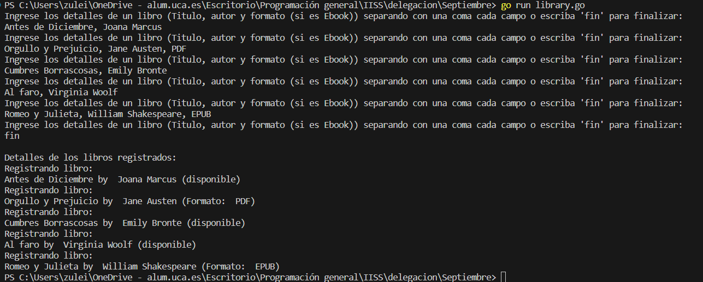

# Ejemplo de uso de Delegación en Go

En primer lugar, para aquel que no conozca el lenguaje de programación Go (también conocido como Golang), se trata de un lenguaje de programación desarrollado por Google. Se ha vuelto popular en el desarrollo de sistemas distribuidos, herramientas de infraestructura y aplicaciones de gran escala. Yo especialemente no conocía este lenguaje, por lo que me ha parecido interesante usarlo para realizar este ejemplo.


En Go, la delegación se implementa mediante la composición de tipos. Go no tiene clases en el sentido tradicionale, pero pueden crearse estructuras que incluyan campos de otros tipos y así podemos lograr implementar la delegación.


El siguiente ejemplo se basa en un sistema de gestión de biblioteca y queremos modelar diferentes tipos de libros (físicos y electrónicos). Además queremos implementar funciones de registro y seguimiento para ambos tipos de libros.


## Implementación

### library.go
```go
package main

import (
	"bufio"
	"fmt"
	"os"
	"strings"
)

// Define una estructura base para un libro con información común.
type Book struct {
	Title  string
	Author string
}

// Define una interfaz para la funcionalidad común de un libro.
type BookOperations interface {
	GetDetails() string
}

// Define una estructura para libros físicos que delega en la estructura base Book.
type PhysicalBook struct {
	Book
	IsAvailable bool
}

// Implementa la interfaz BookOperations para libros físicos.
func (pb PhysicalBook) GetDetails() string {
	availability := "disponible"
	if !pb.IsAvailable {
		availability = "no disponible"
	}
	return fmt.Sprintf("%s by %s (%s)", pb.Title, pb.Author, availability)
}

// Define una estructura para libros electrónicos que también delega en la estructura base Book.
type EBook struct {
	Book
	Format string
}

// Implementa la interfaz BookOperations para libros electrónicos.
func (eb EBook) GetDetails() string {
	return fmt.Sprintf("%s by %s (Formato: %s)", eb.Title, eb.Author, eb.Format)
}

// Función para registrar un libro y mostrar sus detalles.
func RegisterAndDisplayDetails(book BookOperations) {
	fmt.Println("Registrando libro:")
	fmt.Println(book.GetDetails())
}

func main() {
	var books []BookOperations

	// Loop interactivo para que el usuario ingrese detalles de los libros
	for {
		fmt.Println("Ingrese los detalles de un libro (Titulo, autor y formato (si es Ebook)) separando con una coma cada campo o escriba 'fin' para finalizar:")

		// Leer entrada del usuario
		scanner := bufio.NewScanner(os.Stdin)
		scanner.Scan()
		input := scanner.Text()

		// Verificar si el usuario quiere salir del programa
		if strings.ToLower(input) == "fin" {
			break
		}

		// Dividir la entrada en título, autor y formato (si es un libro electrónico)
		bookDetails := strings.Split(input, ",")

		// Verificar si la entrada es válida
		if len(bookDetails) < 2 {
			fmt.Println("Entrada no válida. Debe ingresar al menos título y autor.")
			continue
		}

		// Crear un libro físico por defecto
		var newBook BookOperations = PhysicalBook{
			Book: Book{
				Title:  bookDetails[0],
				Author: bookDetails[1],
			},
			IsAvailable: true,
		}

		// Verificar si se proporcionó el formato para un libro electrónico
		if len(bookDetails) > 2 {
			newBook = EBook{
				Book: Book{
					Title:  bookDetails[0],
					Author: bookDetails[1],
				},
				Format: bookDetails[2],
			}
		}

		// Agregar el libro a la lista
		books = append(books, newBook)
	}

	// Registrar y mostrar detalles de los libros
	fmt.Println("\nDetalles de los libros registrados:")
	for _, book := range books {
		RegisterAndDisplayDetails(book)
	}
}

```


* En primer lugar, definimos la estructura base de `Book`. Se define una estructura básica llamada `Book` que tiene campos para el título y el autor del libro.
* Luego, definimos la interfaz `BookOperations`. Esta representa la funcionalidad común que debe proporcionar cualquier libro. La interfaz exige la implementación de un método `GetDetails()`.
* Posteriormente, definimos la estructura `PhysicalBook`. Esta estructura delega la estructura `Book`. Además, tiene un campo adicional `IsAvailable` que indica si el libro físico está disponible.
* A continuación, implementamos `GetDetails` para `PhysicalBook`. Esta implementación devuelve los detalles del libro físico, incluyendo su disponibilidad.
* Seguimos con la definición de la estructura `EBook`. Esta estructura delega la estructura `Book`. Además, tiene un campo adicional `Format` que indica el formato del libro electrónico.
* Continuamos con la implementación del `GetDetails` para `EBook`. Esta proporciona detalles específicos para los libros electrónicos.
* Realizamos ahora la implementación de la función `RegisterAndDisplayDetails`. Esta función toma un tipo que implementa la interfaz `BookOperations` y muestra los detalles del libro.
* Para finalizar, creamos la función `main`. Recoge libros y muestra su información.


### Ejecución del código
Para ejecutar este código desde terminal, los pasos a seguir son:
1. Asegurarse de tener Go instalado en el sistema.
2. Tener el archivo `.go` en el mismo directorio.
3. Abrir una terminal que apunte al directorio que contiene los archivos.
4. Ejecutar el siguiente comando para ejecutar el código
```bash
go run library.go
```

#### Resultado Esperado

El programa presenta un poco de interación con el usuario ya que muestra un mensaje en el que solicita introducir libros al sistema. Cuando estos son introducidos, podemos seguir haciéndolo hasta que escribamos fin. El programa interpreta en función a la información que le estemos introduciendo si es un libro físico o uno electrónico (dependerá de si le introducimos el formato a continuación del autor). Al finalizar, mostrará todos los detalles de todos los libros que hayamos introducido.


Si el programa funciona correctamente, mostrará el mensaje: *Ingrese los detalles de un libro (Titulo, autor y formato (si es Ebook)) separando con una coma cada campo o escriba 'fin' para finalizar:*. Lo mostrará en bucle hasta que pongamos la palabra fin. Si metemos la información de forma incorrecta mostrará el mensaje: *Entrada no válida. Debe ingresar al menos título y autor.*. Cuando introduzcamos la palabra fin, mostrará el mensaje: *Detalles de los libros registrados:* y la lista de estos (si no hay ninguno no se mostrará nada a continuación del mensaje).

#### Resultado Obtenido

Hacemos una ejecución en el que obtenemos el siguiente resultado (que es variable en función de la interacción de cada usuario):


