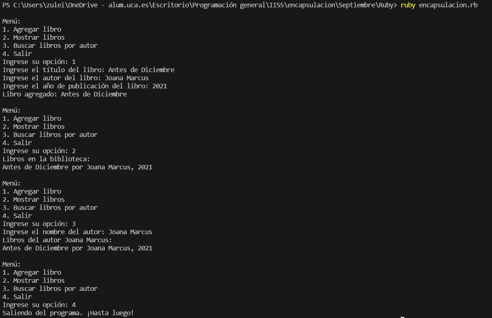

# Ejemplo de uso de Encapsulación en 


Este ejemplo está basado en la gestión de una biblioteca de libros que interactúa con el usuario a través de un menú. La encapsulación en este ejemplo se encuentra en el uso de métodos de acceso y la organización de la funcionalidad dentro de clases.


## Implementación

### encapsulacion.rb
```rb
class Libro
    attr_reader :titulo, :autor, :anio
  
    def initialize(titulo, autor, anio)
      @titulo = titulo
      @autor = autor
      @anio = anio
    end
  
    def to_s
      "#{@titulo} por #{@autor}, #{@anio}"
    end
  end
  
  class Biblioteca
    def initialize
      @libros = []
    end
  
    def agregar_libro(libro)
      @libros << libro
      puts "Libro agregado: #{libro.titulo}"
    end
  
    def mostrar_libros
      if @libros.empty?
        puts "La biblioteca está vacía."
      else
        puts "Libros en la biblioteca:"
        @libros.each { |libro| puts libro }
      end
    end
  
    def buscar_libro_por_autor(autor)
      libros_encontrados = @libros.select { |libro| libro.autor == autor }
      if libros_encontrados.empty?
        puts "No se encontraron libros del autor #{autor}."
      else
        puts "Libros del autor #{autor}:"
        libros_encontrados.each { |libro| puts libro }
      end
    end
  end
  
  # Interacción con el usuario
  biblioteca = Biblioteca.new
  
  loop do
    puts "\nMenú:"
    puts "1. Agregar libro"
    puts "2. Mostrar libros"
    puts "3. Buscar libros por autor"
    puts "4. Salir"
  
    print "Ingrese su opción: "
    opcion = gets.chomp.to_i
  
    case opcion
    when 1
      print "Ingrese el título del libro: "
      titulo = gets.chomp
      print "Ingrese el autor del libro: "
      autor = gets.chomp
      print "Ingrese el año de publicación del libro: "
      anio = gets.chomp.to_i
  
      nuevo_libro = Libro.new(titulo, autor, anio)
      biblioteca.agregar_libro(nuevo_libro)
  
    when 2
      biblioteca.mostrar_libros
  
    when 3
      print "Ingrese el nombre del autor: "
      autor_busqueda = gets.chomp
      biblioteca.buscar_libro_por_autor(autor_busqueda)
  
    when 4
      puts "Saliendo del programa. ¡Hasta luego!"
      break
  
    else
      puts "Opción no válida. Por favor, ingrese una opción válida."
    end
  end
```


* Clase `Libro`:
    * Esta clase representa un libro y tiene tres atributos: `titulo`, `autor`, y `anio`.
    * El método `initialize` es el constructor que se llama al crear una nueva instancia de la clase, estableciendo los atributos del libro.
    * Se utiliza `attr_reader` para crear automáticamente métodos de acceso (`titulo`, `autor`, `anio`) que permiten leer la información del libro.
	    * Estos métodos proporcionan una interfaz controlada para obtener información sobre un libro, encapsulando los detalles internos de la representación del libro.
    * El método `to_s` devuelve una representación de cadena del libro para facilitar su visualización.
* Clase Biblioteca:
    * Esta clase representa una biblioteca y contiene una lista de libros (`@libros`).
    * El método `initialize` es el constructor que inicializa la lista de libros como un arreglo vacío.
    * El método `agregar_libro` permite agregar un libro a la biblioteca, mostrando un mensaje de confirmación.
    * El método `mostrar_libros` muestra la lista de libros en la biblioteca o un mensaje si está vacía.
    * El método `buscar_libro_por_autor` busca y muestra los libros de un autor específico.


      La encapsulación  se logra al proporcionar métodos específicos (mencinados anteriormente) para interactuar con la colección de libros. Esto oculta los detalles internos de cómo se almacenan los libros y cómo se realiza la gestión de la biblioteca.
* Interacción con el Usuario:
    * Se crea una instancia de la clase `Biblioteca` llamada `biblioteca`.
    * Se utiliza un bucle `loop do` para mostrar un menú y procesar las opciones del usuario hasta que el usuario elige salir.
	    * La lógica de la biblioteca y la creación de instancias se encapsulan dentro de este bucle, proporcionando una interfaz clara para la interacción del usuario.
    * El menú ofrece opciones para agregar un libro, mostrar la lista de libros, buscar libros por autor, y salir del programa.


La encapsulación se manifiesta en la limitación del acceso directo a la implementación interna de las clases y la exposición controlada de la funcionalidad a través de métodos de acceso y métodos específicos de la clase.


### Ejecución del código
Para ejecutar este código desde terminal, los pasos a seguir son:
1. Asegurarse de tener Ruby instalado en el sistema.
2. Tener el archivo `.rb` en el mismo directorio.
3. Abrir una terminal que apunte al directorio que contiene el archivo.
4. Ejecutar el siguiente comando para ejecutar el código
```bash
ruby encapsulacion.rb
```

#### Resultado Esperado

En un inicio muestra las opciones que oferce el menú. El resultado es:
* Cuando el usuario elige *"1. Agregar libro"*, el programa solicita información sobre un nuevo libro, crea una instancia de la clase `Libro`, y la agrega a la biblioteca.
* Cuando el usuario elige *"2. Mostrar libros"*, el programa imprime la lista de libros en la biblioteca o un mensaje si está vacía.
* Cuando el usuario elige *"3. Buscar libros por autor"*, el programa solicita el nombre del autor, busca y muestra los libros de ese autor.
* Cuando el usuario elige "4. Salir", el programa imprime un mensaje de despedida y termina.

#### Resultado Obtenido

Hacemos una ejecución en el que obtenemos el siguiente resultado (que es variable en función de la interacción de cada usuario):


