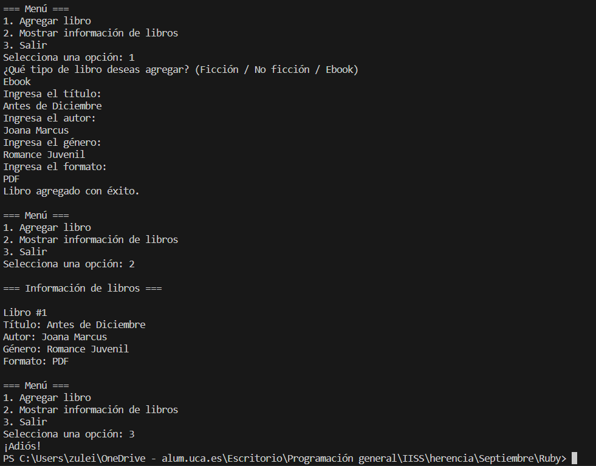

# Ejemplo de uso de Herencia en Ruby


Este ejemplo de programación en Ruby presenta una aplicación simple de gestión de libros con un enfoque en la herencia y la programación orientada a objetos. El sistema modela una biblioteca que contiene diversos tipos de libros, desde obras de ficción hasta no ficción, y libros electrónicos. La herencia se emplea para organizar y estructurar las diferentes categorías de libros, aprovechando la relación "es un/a" entre las clases.


## Implementación

### herencia.rb
```rb
# Clase base Book
class Book
  attr_accessor :title, :author

  def initialize(title, author)
    @title = title
    @author = author
  end

  def display_info
    puts "Título: #{@title}"
    puts "Autor: #{@author}"
  end
end

# Subclase Fiction que hereda de Book
class Fiction < Book
  attr_accessor :genre

  def initialize(title, author, genre)
    super(title, author)
    @genre = genre
  end

  def display_info
    super
    puts "Género: #{@genre}"
  end
end

# Subclase NonFiction que hereda de Book
class NonFiction < Book
  attr_accessor :topic

  def initialize(title, author, topic)
    super(title, author)
    @topic = topic
  end

  def display_info
    super
    puts "Tema: #{@topic}"
  end
end

# Subclase Ebook que hereda de Fiction
class Ebook < Fiction
  attr_accessor :format

  def initialize(title, author, genre, format)
    super(title, author, genre)
    @format = format
  end

  def display_info
    super
    puts "Formato: #{@format}"
  end
end

# Interacción con el usuario
def agregar_libro
  puts "¿Qué tipo de libro deseas agregar? (Ficción / No ficción / Ebook)"
  tipo_libro = gets.chomp.downcase

  case tipo_libro
  when "ficción"
    puts "Ingresa el título:"
    title = gets.chomp
    puts "Ingresa el autor:"
    author = gets.chomp
    puts "Ingresa el género:"
    genre = gets.chomp
    Fiction.new(title, author, genre)
  when "no ficción"
    puts "Ingresa el título:"
    title = gets.chomp
    puts "Ingresa el autor:"
    author = gets.chomp
    puts "Ingresa el tema:"
    topic = gets.chomp
    NonFiction.new(title, author, topic)
  when "ebook"
    puts "Ingresa el título:"
    title = gets.chomp
    puts "Ingresa el autor:"
    author = gets.chomp
    puts "Ingresa el género:"
    genre = gets.chomp
    puts "Ingresa el formato:"
    format = gets.chomp
    Ebook.new(title, author, genre, format)
  else
    puts "Tipo de libro no válido."
  end
end

def mostrar_info(libro)
  libro.display_info
end

# Ejemplo de uso
biblioteca = []

while true
  puts "\n=== Menú ==="
  puts "1. Agregar libro"
  puts "2. Mostrar información de libros"
  puts "3. Salir"
  print "Selecciona una opción: "

  opcion = gets.chomp.to_i

  case opcion
  when 1
    libro = agregar_libro
    biblioteca << libro if libro
    puts "Libro agregado con éxito."
  when 2
    puts "\n=== Información de libros ==="
    biblioteca.each_with_index do |libro, index|
      puts "\nLibro ##{index + 1}"
      mostrar_info(libro)
    end
  when 3
    puts "¡Adiós!"
    break
  else
    puts "Opción no válida. Inténtalo de nuevo."
  end
end
```


* Clase Base `Book`:
    * **Propósito**: Esta es la clase base que representa un libro genérico con un título y un autor.
    * **Herencia**: No hereda de ninguna clase, ya que es la clase base.
* Subclase `Fiction` que hereda de `Book`:
    * **Propósito**: Representa un libro ficción, heredando las propiedades de un libro genérico(`Book`) y agregando el atributo `genre`.
    * **Herencia**: Hereda de la clase `Book`.
* Subclase `Non Fiction` que hereda de `Book`:
    * **Propósito**: Representa un libro de no ficción, heredando las propiedades de un libro genérico(`Book`) y agregando el atributo `topic`.
    * **Herencia**: Hereda de la clase `Book`.
* Subclase `Ebook` que hereda de `Fiction`:
    * **Propósito**: Representa un libro de ficción en formato electrónico  (ebook), heredando las propiedades de un libro de ficción(`Fiction`) y agregando el atributo `format`.
    * **Herencia**: Hereda de la clase `Fiction`, que a su vez hereda de la clase `Book`.
* Interacción con el usuario:
    * **Propósito**: Permite al usuario agregar libros a una biblioteca interactuando con el programa a través de la consola.
    * **Herencia**: Se utiliza la herencia cuando se crean instancias de las subclases basadas en la elección del usuario.
* Mostrar información de libros:
    * **Propósito**: Muestra la información de un libro llamando al método `display_info` del objeto libro.
    * **Herencia**: Se aprovecha la herencia para que el método `display_info` de la clase `Book` sea utilizado por las subclases. En tiempo de ejecución, se ejecutará el método específico de la instancia, ya sea de `Fiction`, `NonFiction`, o `Ebook`.
* Ejemplo de uso:
    * **Propósito**: Ejemplo de uso que permite al usuario agregar libros, mostrar información de los libros y realizar otras acciones a través de un menú interactivo.
    * **Herencia**: La herencia es fundamental para manejar diferentes tipos de libros en la biblioteca de manera eficiente, ya que las subclases heredan propiedades y comportamientos de la clase base `Book`. Esto facilita la gestión y manipulación de objetos de diferentes tipos de libros en una lista común(`biblioteca`).


### Ejecución del código
Para ejecutar este código desde terminal, los pasos a seguir son:
1. Asegurarse de tener Ruby instalado en el sistema.
2. Tener el archivo `.rb` en el mismo directorio.
3. Abrir una terminal que apunte al directorio que contiene el archivo.
4. Ejecutar el siguiente comando para ejecutar el código
```bash
ruby herencia.rb
```

#### Resultado Esperado


El resultado esperado de la ejecución del ejemplo sería una interacción interactiva con el usuario a través de la consola. Aquí hay un resumen de las interacciones y los resultados esperados:

1. Agregar Libros:
    * El usuario selecciona la opción para agregar un libro.
    * Se le pide al usuario que elija el tipo de libro (Ficción, No ficción, Ebook).
    * Según la elección del usuario, se solicitan detalles específicos del libro, como título, autor, género o formato electrónico.
    * Se crea una instancia del libro correspondiente (de la clase Fiction, NonFiction o Ebook) y se agrega a la biblioteca.
2. Mostrar Información de Libros:
    * El usuario selecciona la opción para mostrar la información de los libros.
    * Se recorre la biblioteca y se muestra la información detallada de cada libro, incluyendo los detalles específicos de su tipo (género, tema, formato, etc.).
3. Salir:
    * El usuario puede seleccionar la opción para salir del programa.

El programa sigue ejecutándose en un bucle hasta que el usuario decide salir. Durante cada iteración, el usuario puede agregar libros a la biblioteca, visualizar información detallada sobre los libros existentes, o realizar otras acciones según las opciones proporcionadas en el menú.


#### Resultado Obtenido

Hacemos una ejecución en el que obtenemos el siguiente resultado (que es variable en función de la interacción de cada usuario):


