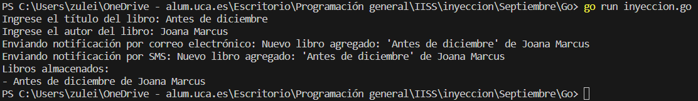

# Ejemplo de uso de Inyección de dependencias en Go


Go es un lenguaje que no se basa típicamente en la inyección de dependencias, pero aún así puedes implementar patrones de diseño que logran el mismo objetivo.

La inyección de dependencias se puede lograr de manera diferente en comparación con lenguajes que cuentan con sistemas más orientados a objetos. Go es un lenguaje de programación concurrente y compilado que se centra en la simplicidad y la eficiencia. Aunque no tiene conceptos de clases y objetos, puedes utilizar funciones y estructuras para implementar patrones de inyección de dependencias.


## Implementación

### inyeccion.go
```go
package main

import (
	"bufio"
	"fmt"
	"log"
	"os"
)

// Notificador es una interfaz que define un método para enviar notificaciones.
type Notificador interface {
	EnviarNotificacion(mensaje string)
}

// AlmacenLibros es una interfaz que define métodos para almacenar y recuperar libros.
type AlmacenLibros interface {
	GuardarLibro(libro *Libro)
	ObtenerLibros() []*Libro
}

// Libro representa un libro con un título y un autor.
type Libro struct {
	Titulo string
	Autor  string
}

// ServicioNotificaciones es una estructura que encapsula la lógica de notificación.
type ServicioNotificaciones struct {
	Notificadores []Notificador
}

// NotificarNuevoLibro notifica a todos los notificadores cuando se ha añadido un nuevo libro.
func (sn *ServicioNotificaciones) NotificarNuevoLibro(libro *Libro) {
	mensaje := fmt.Sprintf("Nuevo libro agregado: '%s' de %s", libro.Titulo, libro.Autor)
	for _, notificador := range sn.Notificadores {
		notificador.EnviarNotificacion(mensaje)
	}
}

// ServicioAlmacenamiento es una estructura que encapsula la lógica de almacenamiento de libros.
type ServicioAlmacenamiento struct {
	Almacen AlmacenLibros
}

// AgregarLibro agrega un nuevo libro al almacenamiento.
func (sa *ServicioAlmacenamiento) AgregarLibro(libro *Libro) {
	sa.Almacen.GuardarLibro(libro)
}

// ServicioLibros es una estructura que coordina las operaciones relacionadas con libros.
type ServicioLibros struct {
	Almacenamiento ServicioAlmacenamiento
	Notificaciones ServicioNotificaciones
}

// AgregarLibro agrega un nuevo libro y notifica sobre la adición.
func (sl *ServicioLibros) AgregarLibro(libro *Libro) {
	sl.Almacenamiento.AgregarLibro(libro)
	sl.Notificaciones.NotificarNuevoLibro(libro)
}

// Implementación concreta de Notificador utilizando correo electrónico.
type CorreoElectronicoNotificador struct{}

// EnviarNotificacion implementa el método de la interfaz Notificador.
func (ce *CorreoElectronicoNotificador) EnviarNotificacion(mensaje string) {
	fmt.Println("Enviando notificación por correo electrónico:", mensaje)
}

// Implementación concreta de Notificador utilizando SMS.
type SMSNotificador struct{}

// EnviarNotificacion implementa el método de la interfaz Notificador.
func (sms *SMSNotificador) EnviarNotificacion(mensaje string) {
	fmt.Println("Enviando notificación por SMS:", mensaje)
}

// Implementación concreta de AlmacenLibros utilizando un slice en memoria.
type MemoriaAlmacenLibros struct {
	Libros []*Libro
}

// GuardarLibro implementa el método de la interfaz AlmacenLibros.
func (mal *MemoriaAlmacenLibros) GuardarLibro(libro *Libro) {
	mal.Libros = append(mal.Libros, libro)
}

// ObtenerLibros implementa el método de la interfaz AlmacenLibros.
func (mal *MemoriaAlmacenLibros) ObtenerLibros() []*Libro {
	return mal.Libros
}

func main() {
	// Configurar servicios con implementaciones concretas.
	var notificadores []Notificador
	notificadores = append(notificadores, &CorreoElectronicoNotificador{})
	notificadores = append(notificadores, &SMSNotificador{})

	servicioNotificaciones := ServicioNotificaciones{Notificadores: notificadores}
	almacenLibros := &MemoriaAlmacenLibros{}

	// Inyectar dependencias en los servicios.
	servicioAlmacenamiento := ServicioAlmacenamiento{Almacen: almacenLibros}
	servicioLibros := ServicioLibros{
		Almacenamiento: servicioAlmacenamiento,
		Notificaciones: servicioNotificaciones,
	}

	// Leer información del libro desde la entrada estándar de manera robusta.
	nuevoLibro, err := leerDatosLibro()
	if err != nil {
		log.Fatal("Error al leer los datos del libro:", err)
	}

	// Agregar un nuevo libro usando el servicio de libros.
	servicioLibros.AgregarLibro(nuevoLibro)

	// Obtener y mostrar todos los libros almacenados.
	librosAlmacenados := servicioAlmacenamiento.Almacen.ObtenerLibros()
	fmt.Println("Libros almacenados:")
	for _, libro := range librosAlmacenados {
		fmt.Printf("- %s de %s\n", libro.Titulo, libro.Autor)
	}
}

func leerDatosLibro() (*Libro, error) {
	scanner := bufio.NewScanner(os.Stdin)

	fmt.Print("Ingrese el título del libro: ")
	scanner.Scan()
	titulo := scanner.Text()

	fmt.Print("Ingrese el autor del libro: ")
	scanner.Scan()
	autor := scanner.Text()

	if err := scanner.Err(); err != nil {
		return nil, err
	}

	return &Libro{Titulo: titulo, Autor: autor}, nil
}
```


* Definición de Interfaces:
    * Se definen las interfaces `Notificador` y `AlmacenLibros` para representar los servicios de notificación y almacenamiento de libros, respectivamente.
* Implementación de Estructuras:
    * Se crean las estructuras `CorreoElectronicoNotificador`, `SMSNotificador`, y `MemoriaAlmacenLibros` que implementan las interfaces `Notificador` y `AlmacenLibros`.
* Servicios de Notificación:
    * `ServicioNotificaciones` se encarga de notificar a través de múltiples notificadores (`Notificador`). Se inyecta una lista de notificadores en su campo Notificadores.
* Servicios de Almacenamiento:
    * `ServicioAlmacenamiento` se encarga de almacenar libros. Se inyecta una implementación concreta de `AlmacenLibros` en su campo `Almacen`.
* Servicios de Libros:
    * `ServicioLibros` coordina las operaciones relacionadas con los libros. Se inyectan instancias de `ServicioAlmacenamiento` y `ServicioNotificaciones`.
* Implementación concretas de Notificadores y Almacenamiento:
    * Se proporcionan implementaciones concretas de `Notificador` (correo electrónico y SMS) y `AlmacenLibros` (almacenamiento en memoria).
* Configuración de Servicios con Implementaciones Concretas:
    * Se crean instancias de las implementaciones concretas y se configuran los servicios principales (`servicioNotificaciones`, `almacenLibros`, `servicioAlmacenamiento`, `servicioLibros`) con estas instancias.
* Lectura de Datos del Libro:
    * Se utiliza la función `leerDatosLibro` para obtener los detalles del libro desde la entrada estándar de manera robusta.
* Agregar Libro y Notificación:
    * Se utiliza el servicio de libros (`servicioLibros`) para agregar el nuevo libro y notificar a través de los servicios de notificación.
* Mostrar Resultados:
    * Se muestra la lista de libros almacenados después de agregar un nuevo libro.

* **Uso de Inyección de Dependencias**:
    * En el servicio de notificacione (`ServicioNotificaciones`):
        * Se inyecta una lista de implementaciones concretas de `Notificador` en el campo `Notificadores`.
    * En el servicio de almacenamiento (`ServicioAlmacenamiento`):
        * Se inyecta una implementación concreta de `AlmacenLibros` en el campo `Almacen`.
    * En el servicio de libros (`ServicioLibros`):
        * Se inyectan instancias de `ServicioAlmacenamiento` y `ServicioNotificaciones`.


### Ejecución del código
Para ejecutar este código desde terminal, los pasos a seguir son:
1. Asegurarse de tener Go instalado en el sistema.
2. Tener el archivo `.go` en el mismo directorio.
3. Abrir una terminal que apunte al directorio que contiene el archivo.
4. Ejecutar el siguiente comando para ejecutar el código
```bash
go run inyeccion.go
```

#### Resultado Esperado


1. El programa solicitará al usuario que ingrese el título y el autor de un libro.
2. Después de ingresar los detalles del libro, el programa mostrará un mensaje indicando que se está enviando una notificación por correo electrónico y por SMS sobre la adición del nuevo libro.
3. Finalmente, se mostrará la lista de libros almacenados, que ahora incluirá el libro recién agregado.


#### Resultado Obtenido

Hacemos una ejecución en el que obtenemos el siguiente resultado (que es variable en función de la interacción de cada usuario):


