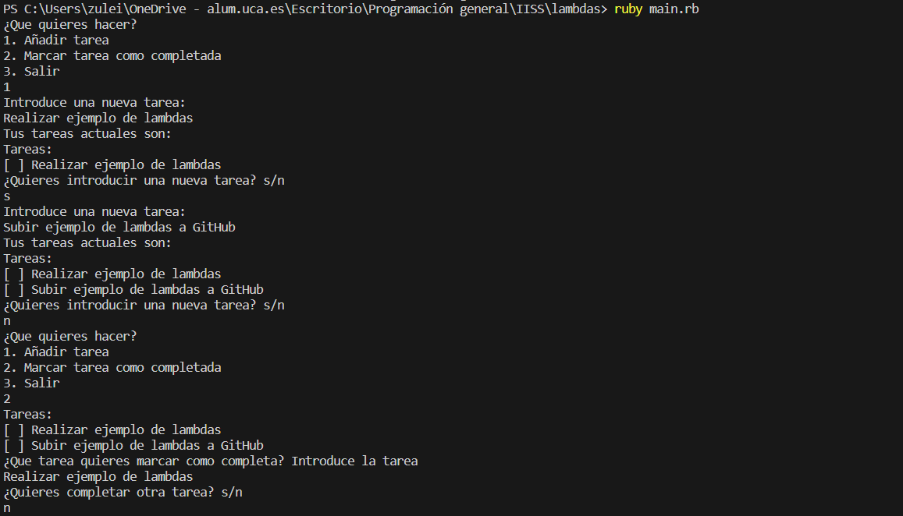
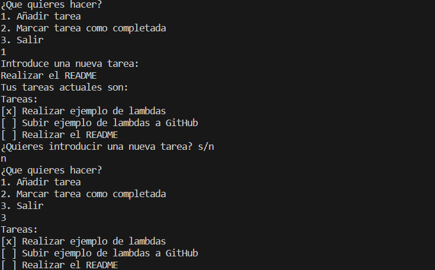

# Ejemplo de uso de Lambdas en Ruby


En Ruby, las lambdas son objetos que representan funciones anónimas. Son útiles cuando necesitas definir pequeñas piezas de código que pueden ser pasadas como argumentos a funciones u operaciones. En este ejemplo, exploraremos cómo se utilizan las lambdas en Ruby para agregar y marcar tareas en una lista de tareas (to-do list).


## Implementación

### task.rb
```ruby
class Task
    attr_accessor :name, :completed
  
    def initialize(name)
      @name = name
      @completed = false
    end
  end
```


* El constructor `initialize` es llamado cuando creamos una nueva instancia de la clase `Task`.


### todo_list.rb
```ruby
require_relative 'task'

class TodoList
  def initialize
    @tasks = []
  end

  def add_task(name)
    task = Task.new(name)
    @tasks.push(task)
  end

  def mark_completed(task_name)
    task = @tasks.find { |t| t.name == task_name }
    if task
      task.completed = true
    else
      puts "Tarea no encontrada: #{task_name}"
    end
  end

  def display_tasks
    puts "Tareas:"
    @tasks.each do |task|
      status = task.completed ? "[x]" : "[ ]"
      puts "#{status} #{task.name}"
    end
  end
end
```


* En este archivo, importamos la clase `Task` desde el archivo 'task.rb' usando `require_relative`. Esto nos permite utilizar la clase `Task` en nuestro programa.
* Luego, definimos la clase `TodoList`. Esta clase representa la lista de tareas y contendrá métodos para agregar tareas, marcarlas como completadas y mostrar la lista de tareas.
* El constructor `initialize` es llamado cuando creamos una nueva instancia de la clase `TodoList`. En este caso, inicializa un array vacío `@tasks` que se utilizará para almacenar las tareas en la lista.
* El método `add_task` toma un argumento `name`, que representa el nombre de la tarea que se va a agregar. Dentro del método, creamos una nueva instancia de la clase `Task` llamada `task`, pasándole el nombre de la tarea como argumento. Luego, agregamos esta instancia de `task` al array `@tasks` utilizando el método `push`. Esto añade la nueva tarea a la lista de tareas.
* El método `mark_completed` permite marcar una tarea como completada, tomando como argumento el nombre de la tarea que se desea marcar. Usamos el método `find` en el array `@tasks` para buscar una tarea con un nombre que coincida con `task_name`. Si se encuentra una tarea que coincide, la asignamos a la variable task.
    * Si `task` es una tarea válida (es decir, se encontró una tarea con ese nombre), establecemos su atributo `completed` en `true`, lo que indica que la tarea está marcada como completada.
    * Si no se encuentra ninguna tarea con el nombre proporcionado, se muestra un mensaje de "Tarea no encontrada".
* El método `display_tasks` se utiliza para mostrar la lista de tareas y sus estados de completado. Comienza mostrando un encabezado que dice "Tareas:". Luego, itera a través de cada tarea en el array `@tasks` utilizando un bucle `each`. Para cada tarea, verifica su estado de completado y asigna `[x]` si está completada o `[ ]` si no lo está a la variable `status`. Finalmente, imprime el estado y el nombre de cada tarea en la lista.


### main.rb

```ruby
require_relative 'todo_list'

todo_list = TodoList.new

# Definimos una lambda para agregar tareas
add_task_lambda = ->(task_name) { todo_list.add_task(task_name) }

# Definimos una lambda para marcar tareas como completadas
mark_completed_lambda = ->(task_name) { todo_list.mark_completed(task_name) }

loop do
puts "¿Que quieres hacer?"
puts "1. Añadir tarea"
puts "2. Marcar tarea como completada"
puts "3. Salir"
op = gets.chop
    if op != '1' && op != '2'
        break
    end
case op
when '1'
    loop do
        puts "Introduce una nueva tarea:"
        tarea = gets
        add_task_lambda.call(tarea)
        puts "Tus tareas actuales son:"
        todo_list.display_tasks
        puts "¿Quieres introducir una nueva tarea? s/n"
        bucle = gets.chomp
        if bucle == 'n'
            break
        end
    end
when '2'
    loop do
        todo_list.display_tasks
        puts "¿Que tarea quieres marcar como completa? Introduce la tarea"
        compl = gets
        mark_completed_lambda.call(compl)
        puts "¿Quieres completar otra tarea? s/n"
        bucle = gets.chomp
        if bucle == 'n'
            break
        end
    end
else
    puts "Opcion no valida"
end
end

# Mostramos la lista de tareas
todo_list.display_tasks
```


* En este archivo, primero creamos una instancia de la clase `TodoList` llamada `todo_list`. Esta instancia representará nuestra lista de tareas en el programa.
* A continuación, definimos dos lambdas:
    * `add_task_lambda`: Esta lambda toma un argumento `task_name` y llama al método `add_task` de `todo_list`, pasando el nombre de la tarea como argumento. Básicamente, esta lambda nos permite agregar tareas a la lista de tareas.
    * `mark_completed_lambda`: Similar a la lambda anterior, toma un argumento `task_name` y llama al método `mark_completed` de `todo_list`, pasando el nombre de la tarea. Esta lambda se utiliza para marcar tareas como completadas en la lista.
Estas lambdas son funciones anónimas que encapsulan la lógica para agregar y marcar tareas, permitiendo una interacción más flexible con la lista de tareas.

* Contiene un bucle que se encarga de crear un menú interactivo para el usuario creando una experiencia interactiva donde puede agregar y marcar tareas utilizando las lambdas previamente definidas.
* Para finalizar, después de que el usuario ha terminado de interactuar con la lista de tareas, el programa llama al método `display_tasks` de `todo_list` para mostrar la lista completa de tareas junto con su estado de completado.


### Ejecución del código
Para ejecutar este código desde terminal, los pasos a seguir son:
1. Asegurarse de tener Ruby instalado en el sistema.
2. Tener los archivos `.rb` en el mismo directorio.
3. Abrir una terminal que apunte al directorio que contiene los archivos.
4. Ejecutar el siguiente comando para compilar el código
```bash
scalac Main.scala
```
5. Una vez compilado con éxito, puedes ejecutar el programa Scala con el comando:
```bash
scala Main
```

#### Resultado Esperado

Después de ejecutar el programa, verás un menú interactivo que te permitirá agregar tareas y marcarlas como completadas. Puedes seguir las instrucciones en la terminal para interactuar con la lista de tareas. Al final, se mostrará la lista de tareas con su estado de completado.

El resultado específico dependerá de las acciones que realices durante la ejecución del programa, como agregar tareas y marcarlas como completadas.

#### Resultado Obtenido

Hacemos una ejecución en el que obtenemos el siguiente resultado:


