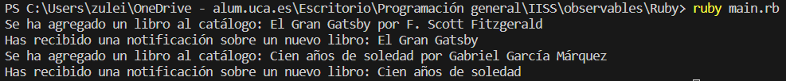

# Ejemplo de uso de Observable en Ruby


El patrón Observador es un patrón de diseño de comportamiento que se utiliza cuando un objeto (sujeto) necesita notificar a otros objetos (observadores) sobre un cambio en su estado. Esto permite que múltiples objetos se mantengan informados y reaccionen a los cambios de manera independiente. En el ejemplo proporcionado, implementamos el patrón Observador para gestionar una biblioteca de libros y notificar a los observadores cuando se agregan nuevos libros.


El programa simula una biblioteca que permite agregar libros y notificar a los observadores cuando se agrega un libro. Los observadores son dos clases (`Catalog` y `Notifications`) que reaccionan a los cambios en la biblioteca. Cuando se agregan libros, los observadores muestran mensajes en la consola.


Este es un ejemplo básico de cómo funciona el patrón Observador en Ruby para notificar a múltiples observadores sobre cambios en un sujeto observable, en este caso, la biblioteca de libros.


## Implementación

### book_library.rb
```ruby
# book_library.rb

class Book
  attr_reader :title, :author

  def initialize(title, author)
    @title = title
    @author = author
  end
end

class Library
  attr_reader :books

  def initialize
    @books = []
    @observers = []
  end

  def add_observer(observer)
    @observers << observer
  end

  def remove_observer(observer)
    @observers.delete(observer)
  end

  def add_book(book)
    @books << book
    notify_observers(book)
  end

  def notify_observers(book)
    @observers.each { |observer| observer.update(self, book) }
  end
end
```


* Contiene las definiciones de las clases `Book` y `Library`, así como la lógica principal del programa.
    * `Book` es una clase que representa un libro con atributos `title` y `author`.
    * `Library` es una clase que actúa como el sujeto observable. Tiene una lista de libros (`@books`) y una lista de observadores (`@observers`). Puede registrar (`add_observer`) y eliminar (`remove_observer`) observadores, y notificar a los observadores cuando se agrega un libro (`add_book`) llamando al método `notify_observers`.


### observers.rb
```ruby
# observers.rb

class Catalog
  def update(library, book)
    puts "Se ha agregado un libro al catálogo: #{book.title} por #{book.author}"
  end
end

class Notifications
  def update(library, book)
    puts "Has recibido una notificación sobre un nuevo libro: #{book.title}"
  end
end
```


* Contiene las definiciones de las clases `Catalog` y `Notifications`, que son observadores interesados en cambios en la biblioteca.
    * `Catalog` es una clase observadora que implementa un método `update`. Cuando se llama a este método, muestra un mensaje que indica que se ha agregado un libro al catálogo, incluyendo el título y el autor del libro.
    * `Notifications` es otra clase observadora que implementa un método `update`. Cuando se llama a este método, muestra un mensaje de notificación sobre un nuevo libro, incluyendo el título del libro.


### main.rb

```ruby
# main.rb

require_relative 'book_library'
require_relative 'observers'

# Crea una instancia de la biblioteca y registra observadores.
library = Library.new
catalog_observer = Catalog.new
notifications_observer = Notifications.new

library.add_observer(catalog_observer)
library.add_observer(notifications_observer)

# Agrega libros a la biblioteca.
book1 = Book.new("El Gran Gatsby", "F. Scott Fitzgerald")
book2 = Book.new("Cien años de soledad", "Gabriel García Márquez")

library.add_book(book1)
library.add_book(book2)

```


* Contiene el código principal que crea instancias de las clases y ejecuta el programa. Requerimos los archivos `book_library.rb` y `observers.rb` para tener acceso a las clases definidas en ellos.
    * Creamos una instancia de la `Library` (biblioteca) y dos instancias de observadores: `Catalog` y `Notifications`.
    * Registramos los observadores con la biblioteca llamando a `library.add_observer(observer)`.
    * Finalmente, agregamos dos libros a la biblioteca (`library.add_book(book1)` y `library.add_book(book2)`), lo que activa la notificación a los observadores.


### Ejecución del código
Para ejecutar este código desde terminal, los pasos a seguir son:
1. Asegurarse de tener Ruby instalado en el sistema.
2. Tener los archivos `.rb` en el mismo directorio.
3. Abrir una terminal que apunte al directorio que contiene los archivos.
4. Ejecutar el siguiente comando para ejecutar el código
```bash
ruby main.rb
```

#### Resultado Esperado

Cuando se ejecuta el programa el resultado que debemos obtener es:
```bash
Se ha agregado un libro al catálogo: El Gran Gatsby por F. Scott Fitzgerald
Has recibido una notificación sobre un nuevo libro: El Gran Gatsby
Se ha agregado un libro al catálogo: Cien años de soledad por Gabriel García Márquez
Has recibido una notificación sobre un nuevo libro: Cien años de soledad
```


#### Resultado Obtenido

Hacemos una ejecución en el que obtenemos el siguiente resultado:

