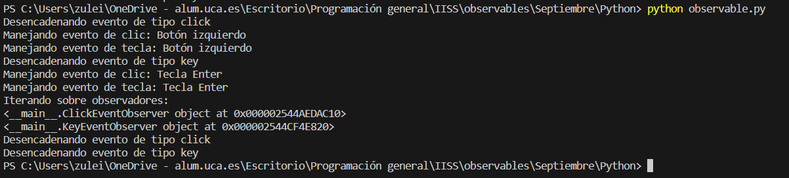

# Ejemplo de uso de Observable en Python


Vamos a hacer un ejemplo que cumple con `Observable = Observador + Iterable`, para ello hemos empleado el lenguaje Python. La biblioteca RxPy no se centra directamente en la iterabilidad, pero si combinamos la funcionalidad de ReactiveX con una lista adicional de observadores podemos conseguirlo.


## Implementación

### observable.py
```py
from rx import Observable
from rx.subject import Subject
import time

# Definición de la interfaz Observer
class Observer:
    def on_next(self, value):
        pass

    def on_error(self, error):
        pass

    def on_completed(self):
        pass


# Implementación de Observable
class AsyncEventSystem:
    def __init__(self):
        self._subject = Subject()
        self._observers = []

    def trigger_event(self, event_type, event_data):
        print(f"Desencadenando evento de tipo {event_type}")
        self._subject.on_next((event_type, event_data))

    def subscribe(self, observer):
        self._observers.append(observer)
        return self._subject.subscribe(observer)

    def observers(self):
        return iter(self._observers)


# Implementación de Observadores
class ClickEventObserver(Observer):
    def on_next(self, value):
        event_type, event_data = value
        print(f"Manejando evento de clic: {event_data}")


class KeyEventObserver(Observer):
    def on_next(self, value):
        event_type, event_data = value
        print(f"Manejando evento de tecla: {event_data}")


# Ejemplo de uso
async_event_system = AsyncEventSystem()

click_observer = ClickEventObserver()
key_observer = KeyEventObserver()

subscription_click = async_event_system.subscribe(click_observer)
subscription_key = async_event_system.subscribe(key_observer)

# Desencadenar eventos
async_event_system.trigger_event("click", "Botón izquierdo")
async_event_system.trigger_event("key", "Tecla Enter")

# Permitir que las suscripciones tengan tiempo para procesar los eventos
time.sleep(1)

# Iterar sobre observadores
print("Iterando sobre observadores:")
for observer in async_event_system.observers():
    print(observer)

# Cancelar las suscripciones
subscription_click.dispose()
subscription_key.dispose()

# Puedes agregar más eventos después de que las suscripciones han sido canceladas
async_event_system.trigger_event("click", "Botón derecho")
async_event_system.trigger_event("key", "Tecla Escape")

# Permitir que las nuevas suscripciones tengan tiempo para procesar los eventos
time.sleep(1)

```


* Elementos:
    * **Clases y Objetos**:
        1. `Observer` (Observador):
            * Es una interfaz que define métodos (`on_next`, `on_error`, `on_completed`) que los observadores deben implementar.
            * En este ejemplo, `ClickEventObserver` y `KeyEventObserver` son las implementaciones concretas de esta interfaz.
        2. `AsyncEventSystem` (Observable):
            * Es la clase que actúa como el objeto observable.
            * Contiene un objeto `Subject` de RxPy, que es una especie de puente entre los observadores y el observable.
            * Tiene una lista `_observers` que se utiliza para mantener la lista de observadores.
            * Métodos:
                * `trigger_event`: Emite un evento a través del `Subject`.
                * `subscribe`: Permite que un observador se suscriba al observable y lo agrega a la lista de observadores.
                * `observers`: Devuelve un iterador sobre la lista de observadores.
    * **Ciclo Principal**:
        1. Creación de instancias:
            * Se crea una instancia de `AsyncEventSystem`.
            * Se crean instancias de `ClickEventObserver` y `KeyEventObserver`.
        2. Suscripción a Eventos:
            * Los observadores (`click_observer` y `key_observer`) se suscriben al `AsyncEventSystem` utilizando el método `subscribe`.
            * Cuando se suscriben, se agregan a la lista de observadores en `AsyncEventSystem`.
        3. Desencadenar Eventos:
            * Se utiliza `trigger_event` para desencadenar eventos (clics y teclas) en el `AsyncEventSystem`.
            * Los eventos se emiten a través del `Subject` que mantiene `AsyncEventSystem`.
        4. Procesamiento Asíncrono:
            * Debido a la naturaleza asíncrona de RxPy, se espera un tiempo para que los observadores procesen los eventos (usando `time.sleep(1)`).
        5. Iteración sobre Observadores:
            * Se utiliza el método `observers()` para obtener un iterador sobre la lista de observadores.
            * Se itera sobre los observadores e imprime sus referencias.
        6. Cancelación de Suscripciones:
            * Se utilizan los métodos `dispose()` de las suscripciones para cancelar las suscripciones de los observadores.
        7. Desencadenar Más Eventos:
            * Se desencadenan más eventos después de que las suscripciones han sido canceladas para mostrar que nuevos observadores no recibirán eventos antiguos.


    * **Cómo cumple con Observable = Observador + Iterable**:
        * Observable (`AsyncEventSystem`):
            * Emite eventos a través del método `trigger_event`.
            * Permite a los observadores suscribirse y los mantiene en una lista interna.
            * Proporciona un método `observers` que devuelve un iterador sobre la lista de observadores, cumpliendo con la parte "Iterable" de la ecuación.
        * Observador (`ClickEventObserver`, `KeyEventObserver`):
            * Implementa la interfaz `Observer`, permitiendo que el `AsyncEventSystem` los notifique cuando se emiten eventos.
            * Se suscribe al `AsyncEventSystem` para recibir eventos.
            * El método `on_next` maneja los eventos y realiza alguna acción.


      En este diseño, la iterabilidad se logra a través de la lista de observadores en AsyncEventSystem. Aunque la iteración es explícita en este caso (a través de observers()), es una forma de cumplir con la idea de que Observable = Observador + Iterable.


### Ejecución del código
Para ejecutar este código desde terminal, los pasos a seguir son:
1. Asegurarse de tener Python instalado en el sistema y que está instalado RxPy (`pip install rx`).
2. Tener el archivo `.py` en el mismo directorio.
3. Abrir una terminal que apunte al directorio que contiene el archivo.
4. Ejecutar el siguiente comando para ejecutar el código
```bash
python observable.py
```

#### Resultado Esperado

Las salidas pueden variar ligeramente dependiendo de la velocidad del sistema y la concurrencia, pero la estructura general debería ser la misma:
```bash
Desencadenando evento de tipo click
Manejando evento de clic: Botón izquierdo
Desencadenando evento de tipo key
Manejando evento de tecla: Tecla Enter
Iterando sobre observadores:
<__main__.ClickEventObserver object at 0x...>
<__main__.KeyEventObserver object at 0x...>
Desencadenando evento de tipo click
Desencadenando evento de tipo key
Manejando evento de clic: Botón derecho
Manejando evento de tecla: Tecla Escape
```

Este es un desglose de las líneas principales del resultado:

1. Se desencadenan eventos de clic y tecla.
2. Se imprime el manejo de eventos por parte de los observadores (clic y tecla).
3. Se itera sobre los observadores y se imprime su referencia.
4. Se desencadenan más eventos después de que las suscripciones han sido canceladas.
5. Se imprime el manejo de eventos por parte de los nuevos observadores (que no reciben eventos antiguos).


#### Resultado Obtenido

Hacemos una ejecución en el que obtenemos el siguiente resultado:


