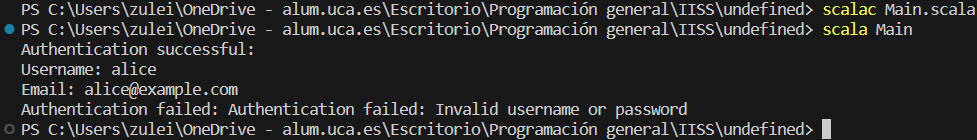

# Ejemplo de Uso de Undefined en Scala

En Scala no se usa la palabra clave `undefined`, por lo que no exite una función o palabra reservada con ese nombre que utilice para representar valores no definidos o nulos. Pero Scala hace manejo de valores nulos.
Los valores nulos se manejan principalmente utilizando la opción `Option` que es una abstracción que puede contener un valor `Some` si está presente o `None` si está ausente. Esto permite manejar de manera segura los casos en los que un valor puede ser nulo.


## Implementación

### Authentication.scala

```scala
object Authentication {
  def authenticateUser(username: String, password: String): Either[String, User] = {
    // Simulación de autenticación exitosa
    if (username == "alice" && password == "secret") {
      val user = User("alice", Some("alice@example.com"))
      Right(user)
    } else {
      // Autenticación fallida, devolver un mensaje de error
      Left("Authentication failed: Invalid username or password")
    }
  }
}
```


* `Authentication` es un objeto Singleton en Scala que contiene la lógica de autenticación.
* `authenticateUser` es un método que toma un nombre de usuario (`username`) y una contraseña (`password`) como argumentos.
* La función devuelve un valor de tipo `Either[String, User]`. Either es una unión de dos tipos posibles: `Left` (en este caso, un mensaje de error como String) o `Right` (en este caso, un objeto User).
* Si las credenciales coinciden con "alice" y "secret", se crea un objeto `User` y se devuelve a través de `Right(user)`. De lo contrario, se devuelve un mensaje de error a través de `Left`.


### User.scala
```scala
case class User(username: String, email: Option[String])

object User {
  def printUserInfo(user: User): Unit = {
    println(s"Username: ${user.username}")
    user.email match {
      case Some(email) => println(s"Email: $email")
      case None => println("Email: Not provided")
    }
  }
}
```


* `User` es una case class que representa un usuario con un nombre de usuario (`username`) y una dirección de correo electrónico opcional (`email`).
* `printUserInfo` es un método definido en el objeto `User`. Imprime información sobre el usuario en la consola, incluyendo el nombre de usuario y, si la dirección de correo electrónico está presente, la dirección de correo electrónico; de lo contrario, muestra "Email: Not provided".


### Main.scala
```scala
import java.util.Scanner

object Main {
  def main(args: Array[String]): Unit = {
    val authResult1 = Authentication.authenticateUser("alice", "secret")
    val authResult2 = Authentication.authenticateUser("bob", "password")

    authResult1 match {
      case Right(user) =>
        println("Authentication successful:")
        User.printUserInfo(user)
      case Left(errorMessage) =>
        println(s"Authentication failed: $errorMessage")
    }

    authResult2 match {
      case Right(user) =>
        println("Authentication successful:")
        User.printUserInfo(user)
      case Left(errorMessage) =>
        println(s"Authentication failed: $errorMessage")
    }
  }
}
```

* `Main` es un objeto que contiene el punto de entrada principal de la aplicación.
* En el método `main`, se intenta autenticar a dos usuarios diferentes ("alice" y "bob") con sus respectivas contraseñas utilizando el método `authenticateUser` de `Authentication`.
* Se almacenan los resultados de autenticación en las variables `authResult1` y `authResult2`.
* Se utiliza el patrón `match` para manejar los resultados de autenticación, imprimiendo un mensaje de éxito o error en función del resultado y mostrando la información del usuario autenticado si la autenticación fue exitosa.


### Ejecución del código
Para ejecutar este código desde terminal, los pasos a seguir son:
1. Asegurarse de tener Scala instalado en el sistema.
2. Tener los archivos `.scala` en el mismo directorio.
3. Abrir una terminal que apunte al directorio que contiene los archivos.
4. Ejecutar el siguiente comando para compilar el código
```bash
scalac Main.scala
```
5. Una vez compilado con éxito, puedes ejecutar el programa Scala con el comando:
```bash
scala Main
```

#### Resultado Esperado

Después de ejecutar el programa, el resultado esperado en la consola es:
```bash
Authentication successful:
Username: alice
Email: alice@example.com
Authentication failed: Invalid username or password
```

#### Resultado Obtenido

Efectivamente el resultado obtenido es el mismo al esperado, como podemos observar en la siguiente foto:

